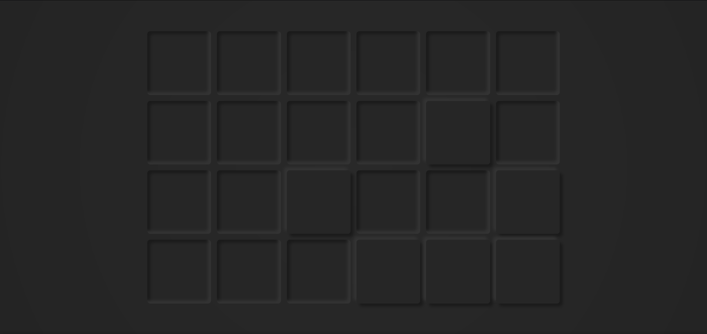

# vue-clock

Simple binary clock made with Vue using neumorphism

## Table of contents
- [Introduction](#introduction)
- [Technologies](#technologies)
- [Illustrations](#illustrations)
- [To-Do](#to-do)

## Introduction
This project is a practice with Vue JS (3.0 to be precise) while also incorporating something currently (Sort of) trending: Neumorphism.

It is a binary clock, but instead of being color coded, it uses neumorphism to represent the zeroes and ones.

## Technologies
- Vue JS v3.0.0
- TypeScript v4.1.5

## Illustrations
| Clock at 00:21:53 |
|:---:|
||
## To-Do
